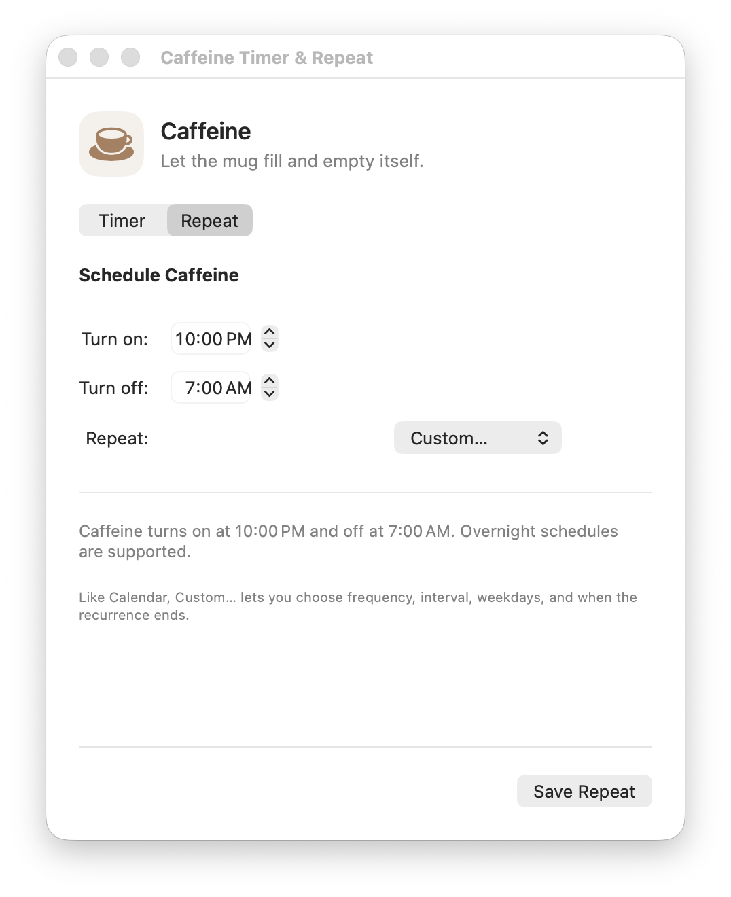

# Caffeine Toggle

A native macOS Control Center toggle with timers and repeating schedules that keeps a Mac awake and optionally prevents lid-close sleep.

**Website:** [kimiyashar.github.io/caffeine-toggle](https://kimiyashar.github.io/caffeine-toggle/)

- Single-click the mug: toggle immediately
- Double-click the mug: open Timer and Repeat settings
- Timer: keep Caffeine on for 30 minutes, 1, 2, 4, or 8 hours, then turn off automatically
- Repeat: run daily, weekly, monthly, yearly, or on custom intervals and weekday combinations
- Calendar-style Custom recurrence can end never, on a date, or after a chosen number of occurrences
- Choose separate on and off times; overnight schedules are supported
- Empty mug: normal sleep behavior
- Filled mug: prevents idle sleep and disables clamshell sleep
- Native WidgetKit Control Center controls
- Background AppKit helper owns timers, repeating schedules, and the `caffeinate` process



> [!WARNING]
> Caffeinated mode is designed to keep the Mac running with its lid closed, but physical lid-close behavior has not been verified on every Mac. Keep it plugged in on a hard, open, ventilated surface—never inside a bag, sleeve, bed, or other poorly ventilated space. CPU/GPU-heavy work can generate substantial heat.

## Requirements

- macOS 26 or later
- Apple Silicon Mac
- Xcode 26 or later
- [XcodeGen](https://github.com/yonaskolb/XcodeGen)
- An Apple Development signing team

## Build

```sh
xcodegen generate
xcodebuild \
  -project CaffeineToggle.xcodeproj \
  -scheme CaffeineToggle \
  -configuration Release \
  -derivedDataPath .derived \
  build
```

Before building, replace the development team and bundle identifiers in `project.yml` with values for your Apple Developer account.

The built app is located at:

```text
.derived/Build/Products/Release/Caffeine Toggle.app
```

Copy it to `/Applications` or `~/Applications`, launch it, then open **Control Center → Edit Controls**, search for **Caffeine**, and add the toggle. You can also add the separate **Caffeine Timer & Repeat** control for one-click access to settings.

- Single-click the mug to toggle Caffeine immediately.
- Double-click the mug to open the Timer and Repeat window.
- Choose **Timer** for a one-off session, or **Repeat** for daily, weekly, monthly, yearly, or **Custom…** recurrence with intervals, weekdays, and end conditions.
- Manual changes remain available; the next scheduled boundary takes over automatically.

For automatic startup, add Caffeine Toggle under **System Settings → General → Login Items**.

## Command interface

The app executable also supports:

```sh
CaffeineToggle --on
CaffeineToggle --off
CaffeineToggle --toggle
CaffeineToggle --status
CaffeineToggle --session 120
CaffeineToggle --session-status
CaffeineToggle --stop-session
CaffeineToggle --schedule 22:00 07:00
CaffeineToggle --schedule-status
CaffeineToggle --disable-schedule
CaffeineToggle --show-schedule
```

## How it works

The helper launches:

```text
/usr/bin/caffeinate -d -i -m -s -w <helper-pid>
```

It also calls the private IOKit root-domain selector used to change clamshell sleep behavior. Turning the control off restores normal clamshell sleep before terminating `caffeinate`. The helper schedules the next selected on/off boundary with a local timer and recalculates after wake, clock changes, time-zone changes, or helper restarts so missed transitions do not leave stale state.

## Important limitations

- The clamshell API is private and unsupported by Apple. A macOS update may change or break it.
- The app must remain running for the Control Center toggle and schedules to control the helper.
- Physical lid-close behavior should be tested on each target Mac before relying on it.
- This is not intended for Mac App Store distribution.

## Tests

```sh
xcodebuild test \
  -project CaffeineToggle.xcodeproj \
  -scheme CaffeineToggleTests \
  -destination 'platform=macOS' \
  -derivedDataPath .derived-tests
```

## License

MIT
