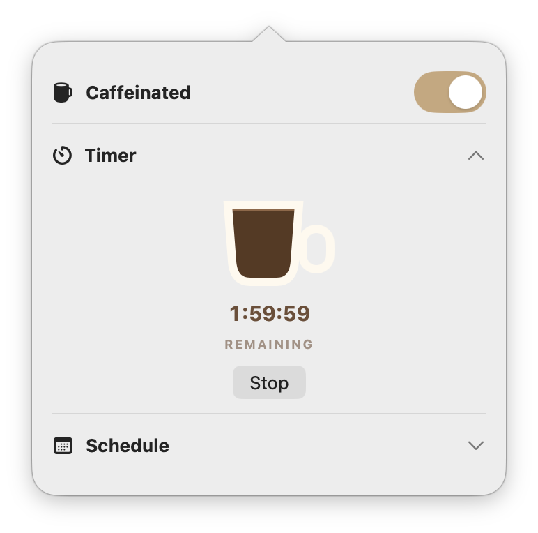
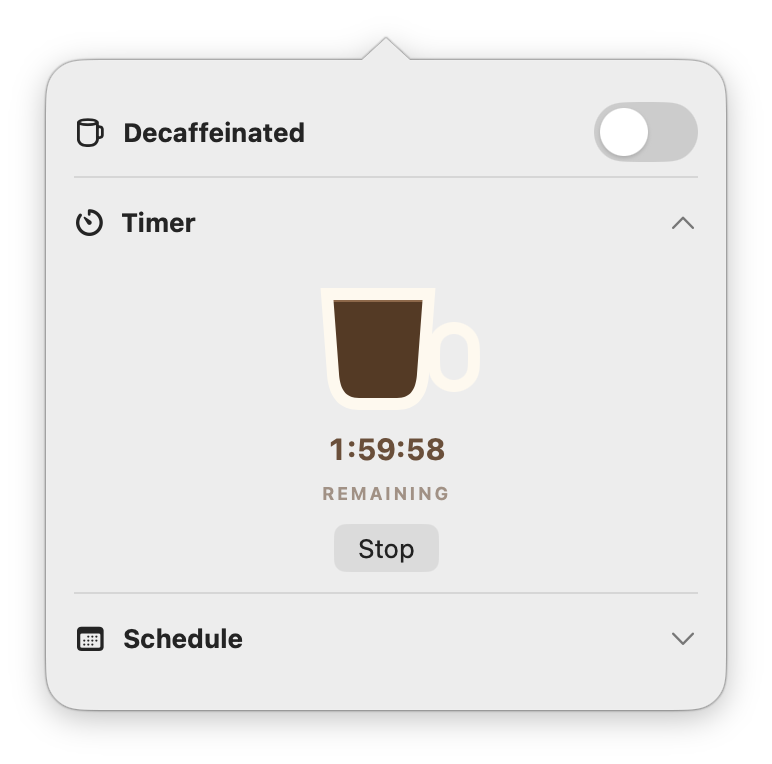
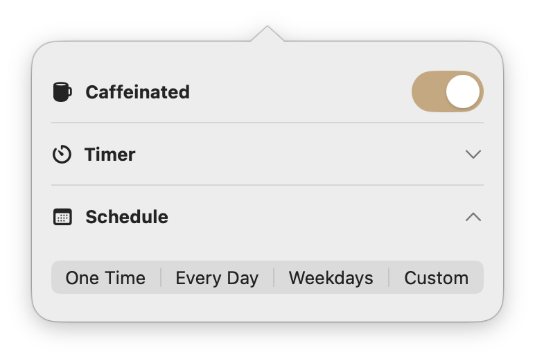

# Caffeine Toggle

A tiny native macOS menu-bar app that keeps your Mac awake—with a visual Timer and flexible schedules.

<p align="center">
  
</p>

<p align="center">
  <a href="https://github.com/kimiyashar/caffeine-toggle/releases/latest/download/Caffeine-Toggle-3.0.zip"><strong>⬇ Download Caffeine Toggle 3.0</strong></a>
  &nbsp;·&nbsp;
  <a href="https://kimiyashar.github.io/caffeine-toggle/">Website</a>
</p>

## Download and install

**You do not need Xcode or Terminal.**

1. **[Download Caffeine Toggle 3.0](https://github.com/kimiyashar/caffeine-toggle/releases/latest/download/Caffeine-Toggle-3.0.zip).**
2. Open the downloaded ZIP, then drag **Caffeine Toggle** into your **Applications** folder.
3. The first time only, Control-click **Caffeine Toggle** in Applications and choose **Open**, then **Open** again.

If macOS still blocks the app, open **System Settings → Privacy & Security**, scroll down, and click **Open Anyway** next to Caffeine Toggle. This release is signed but not yet notarized for automatic Gatekeeper approval.

**Requires an Apple Silicon Mac running macOS 26 or later.**

## Use it

- **Left-click the menu-bar mug:** turn Caffeine on or off immediately.
- **Right-click or two-finger click the mug:** open the attached Timer and Schedule panel.
- **Filled menu-bar mug:** Caffeine is on; idle sleep is prevented.
- **Empty menu-bar mug:** Caffeine is off; normal sleep behavior is restored.

### The coffee-cup Timer

<p align="center">
  
  &nbsp;&nbsp;
  
</p>

Every Timer begins with a full cup and drains toward empty relative to that Timer's own duration. A 10-minute Timer and a 7-day Timer both start completely full, look half full halfway through, and end completely empty. Turning Caffeine off pauses both the countdown and the coffee level; turning it back on resumes them.

### Four ways to schedule

<p align="center">
  
</p>

- **One Time** — one specific start and stop.
- **Every Day** — the same window daily.
- **Weekdays** — Monday through Friday.
- **Custom** — independent time windows for whichever weekdays you choose.

Overnight windows are supported. Manual changes always work; the next scheduled boundary takes over automatically.

## UI gallery

| Timer running | Timer paused | Schedule modes |
|---|---|---|
|  |  |  |

## Start automatically

Open **System Settings → General → Login Items**, click **+**, and add **Caffeine Toggle**.

> [!WARNING]
> An awake Mac can generate heat. Keep it plugged in on a hard, open, ventilated surface—never in a bag, sleeve, bed, or other enclosed space. The closed-lid behavior uses a private macOS interface and should be tested on your own Mac before you rely on it.

## Build from source

Developers need Xcode 26 or later, [XcodeGen](https://github.com/yonaskolb/XcodeGen), and an Apple Development signing team. Replace the development team and bundle identifiers in `project.yml`, then run:

```sh
xcodegen generate
xcodebuild \
  -project CaffeineToggle.xcodeproj \
  -scheme CaffeineToggle \
  -configuration Release \
  -derivedDataPath .derived \
  build
```

The app will be at `.derived/Build/Products/Release/Caffeine Toggle.app`.

## Command interface

```sh
CaffeineToggle --on
CaffeineToggle --off
CaffeineToggle --toggle
CaffeineToggle --status
CaffeineToggle --session 120
CaffeineToggle --session-status
CaffeineToggle --stop-session
CaffeineToggle --schedule 22:00 07:00
CaffeineToggle --schedule-status
CaffeineToggle --disable-schedule
CaffeineToggle --show-schedule
```

The app owns exactly one PID-bound child process:

```text
/usr/bin/caffeinate -d -i -m -s -w <app-pid>
```

## Tests

```sh
xcodebuild test \
  -project CaffeineToggle.xcodeproj \
  -scheme CaffeineToggleTests \
  -destination 'platform=macOS' \
  -derivedDataPath .derived-tests
```

## License

MIT
